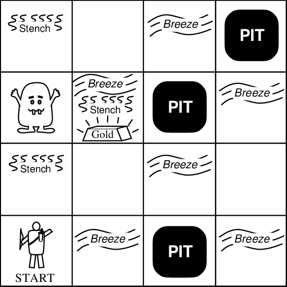

# Welcome to Wumpus World
(This was an assignment for my university course: CSE108 - Object Oriented Programming Sessional. It seemed to be a fun terminal game so I decided to put it here for others to try!)

## Game introduction

<div align="center">
  
</div>

Wumpus world is a popular grid game. The grid is a 4x4 array of cells. The bottom left cell is [0,0] and
the top right cell is [3,3]. In any of these 16 cells, there can be:
1. Wumpus
2. Pit
3. Gold
If you want to survive in this world, you must get to the gold and hold it above your head to announce
your victory. You do not know where the gold is. You may think scanning the whole grid would suffice to
win, but the Wumpus and the Pit are there to stop you.
There is a Wumpus in the grid. The Wumpus is a smelly blind creature that devours souls when someone
is in the same cell with it. It gives away a terrible smell, and if you are right by its cell, you will experience
a stench.
There is a Pit in the grid. (The original version of the game can have any number of pits. For simplicity,
we assume that there is only one pit). If you step in the Pit, you will have to rot there forever! However,
you can always feel a breeze if you are right by the Pit.
As a player, you start from [0,0], moving upwards. You have the following moves:
1. Turn Right: Changes your moving direction
2. Turn Left: Changes your moving direction
3. Move Forward: Move to the next cell along the moving direction4. Shoot: You have 3 arrows with you. You can shoot the arrow at your moving direction. If the
Wumpus is in that direction, it will scream loudly in pain and die. But if it is behind you, you
cannot touch it. You must turn around before shooting to kill it.

## How to run the game in your local machine
 - Clone the repository
 - Make sure you are in the folder containing the file 'wumpus.cpp'
 - Run the following command
    ```
    g++ wumpus.cpp -o a;./a
    ```

You should be seeing the game in your terminal. Good luck finding the gold!

## Emoji Constraints
I developed the game in a linux machine and the emojis seemed to work very well here. So if you have a different OS, 
chances are the emojis may not show properly for you. 

